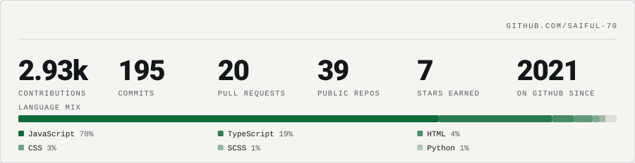

# Saiful Islam

Software engineer in **Dhaka, Bangladesh** (UTC+6), open to remote. 3.5+ years building
**reactive, signals-first** interfaces in **Angular** and **React** — and the **.NET / Node**
behind them, down to the database and the monitoring that watches it.

**Four enterprise ERP platforms**, a **multi-tenant SaaS**, and **6+ products live**, across
three companies since 2023 — each running behind its own self-hosted observability stack.
Modules shipped: **access control, accounting, HR, production, inventory** on the ERP side;
**deviation, checklist, handbook, compliance, settings** on the QMS side. I work **AI-native** —
Claude, Cursor, Ollama and OpenCode as a force multiplier, not a shortcut.

---

### Things I shipped on my own time

| Project | What it is | Status |
| --- | --- | --- |
| **[CampusQ](https://campusqbd.com)** | Multi-tenant coaching-management SaaS — tenant isolation via Postgres RLS, bitmask RBAC, online exams, bKash/Nagad payments, PWA + push, bilingual (en/bn). Runs behind a self-hosted LGTM stack: OpenTelemetry traces into Tempo, Prometheus metrics, Loki logs, Grafana alerts to Telegram. `.NET 10 · Angular 21 · Next.js 16` | live |
| **Rent-ERP** | Single-org property-management ERP across three surfaces — .NET 10 modular monolith, Angular 21 admin console, and a React Native app serving tenants & staff. Property hierarchy, per-tenant billing with bKash, accounting, HRM, SMS/FCM notifications. `.NET 10 · Angular 21 · React Native` | source private |
| **[ngx-primeng-toolkit](https://www.npmjs.com/package/ngx-primeng-toolkit)** | Open-source Angular library — parameterized query/table state, memoized data & reusable utilities, released to npm with automated CI/CD. | published |
| **[DebuggerMind Commerce](https://www.pogiit.com/)** | In-house white-label storefront (Next.js 15 + .NET API) — international build and a localized Bengali variant maintained in parallel, 6 languages. | live |

### Open source I contribute to

**[Optimus UI](https://github.com/openng-org/optimus-ui)** — 80+ accessible, customizable
Angular components under the MIT licence; a community-maintained continuation of PrimeNG v21.
I am a contributor, and it is the component layer under CampusQ's client.

---

### The stack it all runs on

**Frontend**

**Backend & data**

**Testing**

**DevOps & infra**

**Observability**

**AI & dev tools**

Ask me about **Angular Signals**, **multi-tenant architecture**, **Postgres RLS**,
**cross-platform React Native**, **.NET**, and **self-hosting an observability stack
that fits on one VPS**. Open to collaboration.

---

### At a glance

<picture>
  <source media="(prefers-color-scheme: dark)" srcset="assets/stats-dark.svg">
  
</picture>

Rendered from the GitHub API into a committed SVG and refreshed weekly by
<a href=".github/workflows/profile-stats.yml">a workflow</a> — no card service to go down.

---

### Elsewhere

| Platform | Handle | Profile |
| --- | --- | --- |
| LeetCode | `saiful70` | [leetcode.com/saiful70](https://leetcode.com/saiful70/) |
| Codewars | `saiful70` | [codewars.com/users/saiful70](https://www.codewars.com/users/saiful70) |
| Codeforces | `KhaWareZmI` | [codeforces.com/profile/KhaWareZmI](https://codeforces.com/profile/KhaWareZmI) |

Dhaka, BD · UTC+6 · <a href="https://saiful-70.github.io/saiful-70/">saiful-70.github.io/saiful-70</a>
